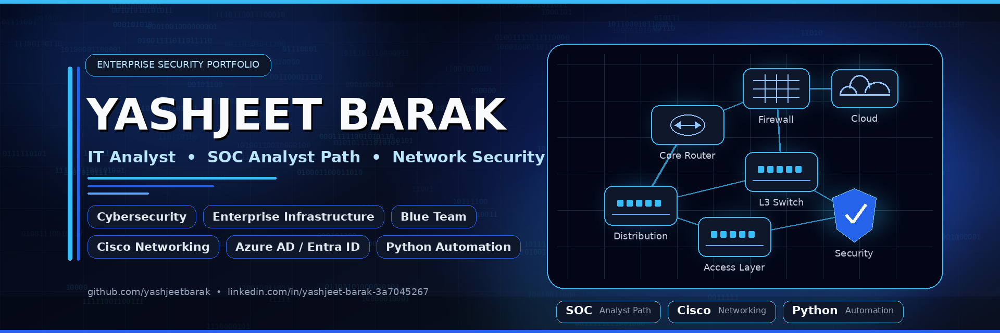

<!--
  GitHub Profile README for Yashjeet Barak
  Repository name must be exactly: yashjeetbarak
  Upload this file as: README.md
-->

<p align="center">
  
</p>

<h1 align="center">Yashjeet Barak</h1>

<p align="center">
  <strong>IT Analyst | SOC Analyst Path | Network Security | Cybersecurity Automation</strong>
</p>

<p align="center">
  <a href="https://git.io/typing-svg">
    
  </a>
</p>

<p align="center">
  <a href="mailto:yashjeet820@gmail.com"></a>
  <a href="https://www.linkedin.com/in/yashjeet-barak-3a7045267/"></a>
  <a href="https://github.com/yashjeetbarak"></a>
</p>

<p align="center">
  
</p>

---

## Professional Summary

I am an **IT Analyst at HCLTech** with hands-on experience across enterprise IT operations, incident management, ServiceNow, Microsoft 365, Azure AD / Entra ID, Windows administration, root cause analysis, SLA-driven support, and production troubleshooting.

My current focus is the transition into **SOC Analyst, Cybersecurity Analyst, Network Security Engineer, Blue Team, and Enterprise Security Operations** roles. I build practical projects that connect real enterprise operations with security-focused networking, automation, investigation workflows, and vulnerability discovery.

I am especially interested in the intersection of:

- Enterprise infrastructure support
- Network security architecture
- Security operations and incident investigation
- Python-based cybersecurity automation
- Blue team detection and response fundamentals

---

## Current Role

<table>
  <tr>
    <td width="35%"><strong>Position</strong></td>
    <td>IT Analyst</td>
  </tr>
  <tr>
    <td><strong>Company</strong></td>
    <td>HCLTech</td>
  </tr>
  <tr>
    <td><strong>Experience</strong></td>
    <td>2+ Years</td>
  </tr>
  <tr>
    <td><strong>Location</strong></td>
    <td>India</td>
  </tr>
  <tr>
    <td><strong>Career Direction</strong></td>
    <td>SOC Analyst • Cybersecurity Analyst • Network Security Engineer • Blue Team • Enterprise Security</td>
  </tr>
</table>

### Enterprise IT Operations Experience

- Incident management and production support in enterprise environments
- ServiceNow ticket handling, tracking, escalation, and SLA ownership
- Microsoft 365 support and enterprise user troubleshooting
- Azure AD / Entra ID identity and access support
- Windows administration and endpoint troubleshooting
- Root cause analysis for recurring incidents and operational issues
- User support, access support, and enterprise troubleshooting workflows

---

## Current Focus

```txt
SOC Analyst Fundamentals
Network Security Engineering
Cisco Enterprise Networking
Threat Analysis & Incident Investigation
Python Security Automation
Bug Bounty Reconnaissance Workflows
Blue Team Operations
Vulnerability Assessment
```

---

## Technical Expertise

### Networking

<p>
  
  
  
  
  
  
  
  
  
  
  
  
  
  
</p>

### Cybersecurity

<p>
  
  
  
  
  
  
  
  
</p>

### Automation, Operating Systems & Enterprise Tools

<p>
  
  
  
  
  
  
  
  
  
  
  
  
  
</p>

---

## Security Toolkit

<table>
  <tr>
    <td><strong>Reconnaissance</strong></td>
    <td>Nmap, Subfinder, Assetfinder, Amass, httpx, WhatWeb, Recon-ng, theHarvester, Shodan, Google Dorking</td>
  </tr>
  <tr>
    <td><strong>Web Security</strong></td>
    <td>Burp Suite, OWASP ZAP, FFUF, Gobuster, Dirsearch, Nikto, Nuclei, Dalfox</td>
  </tr>
  <tr>
    <td><strong>Network Analysis</strong></td>
    <td>Wireshark, Tcpdump, Netcat, Curl, Wget</td>
  </tr>
  <tr>
    <td><strong>Learning</strong></td>
    <td>Metasploit, SQLMap, John the Ripper, Hashcat, Hydra, Bash, PowerShell</td>
  </tr>
</table>

---

## Certifications & Training

| Certification / Training | Status |
|---|---|
| Diploma in Ethical Hacking & Cybersecurity | In Progress |
| CCNA Training | Completed / Ongoing Learning |
| CEH v13 Training | Completed / Ongoing Learning |
| ISC2 Certified in Cybersecurity Training | Completed / Ongoing Learning |
| Microsoft 365 Copilot GenAI L2 | Completed |

---

## Featured Projects

### THOR — Automated Recon & Vulnerability Discovery Framework

<p>
  <a href="https://github.com/yashjeetbarak/thor-recon-framework">
    
  </a>
</p>

**Status:** Currently under development  
**Focus:** Python automation, Linux, Kali, bug bounty reconnaissance, vulnerability discovery

THOR is being designed as a modular reconnaissance and vulnerability discovery framework for structured bug bounty workflows. The project focuses on automating repetitive recon tasks while keeping the workflow readable, auditable, and useful for security learning.

**Planned / Active Capabilities**

- Subdomain enumeration
- Live host detection
- HTTP probing
- Directory discovery
- Parameter discovery
- URL collection
- Dalfox integration
- Nuclei integration
- Recon automation workflow
- Future plugin architecture
- Future HTML reporting
- Future Discord / Slack notification support
- Future Docker support

---

### Enterprise Headquarters Network — High Availability Design

<p>
  <a href="https://github.com/yashjeetbarak/enterprise-headquarters-network-ha">
    
  </a>
</p>

Enterprise headquarters network design focused on high availability, redundancy, core switching, failover validation, and enterprise-grade network architecture.

**Core Concepts**

- HSRP
- Redundant core design
- Layer 3 switching
- EtherChannel
- STP optimization
- Failover validation
- Enterprise topology planning

---

### Enterprise Campus Network — Layer 3 Architecture

<p>
  <a href="https://github.com/yashjeetbarak/enterprise-campus-network-l3">
    
  </a>
</p>

Three-tier enterprise campus network built around scalable switching, routing, segmentation, and operational verification.

**Core Concepts**

- Three-tier architecture
- SVI routing
- Layer 3 switching
- DHCP
- VLAN design
- EtherChannel
- STP
- Enterprise design principles

---

### Enterprise Network — OSPF, VLAN, ACL & DHCP

<p>
  <a href="https://github.com/yashjeetbarak/enterprise-network-ospf-vlan-acl">
    
  </a>
</p>

Enterprise routing and segmentation project focused on secure access, routing design, remote management, and verification.

**Core Concepts**

- OSPF
- VLAN segmentation
- ACL policy control
- SSH management
- DHCP
- Inter-VLAN routing
- Enterprise routing fundamentals

---

## GitHub Analytics

<p align="center">
  
  
</p>

<p align="center">
  
</p>

<p align="center">
  
</p>

<p align="center">
  
</p>

---

## Engineering Direction

I am building my portfolio around practical security and infrastructure work rather than theory alone.

My long-term direction is to grow into roles where I can combine:

- Enterprise troubleshooting discipline
- Network security architecture
- SOC investigation workflows
- Threat detection fundamentals
- Automation-driven security operations

---

## Connect With Me

<p align="center">
  <a href="mailto:yashjeet820@gmail.com"></a>
  <a href="https://www.linkedin.com/in/yashjeet-barak-3a7045267/"></a>
  <a href="https://github.com/yashjeetbarak"></a>
</p>

---

<p align="center">
  <strong>Enterprise IT • Network Security • Cybersecurity Automation • Blue Team</strong>
</p>

<p align="center">
  <sub>Designed with a dark enterprise security aesthetic inspired by Microsoft Security, Cisco, CrowdStrike, Palo Alto Networks, and GitHub Enterprise.</sub>
</p>
